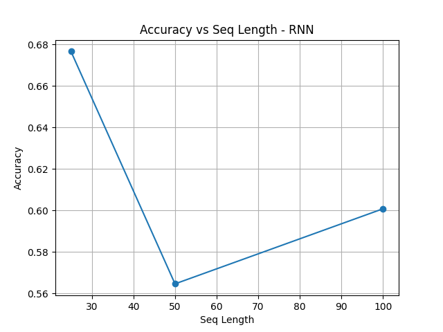
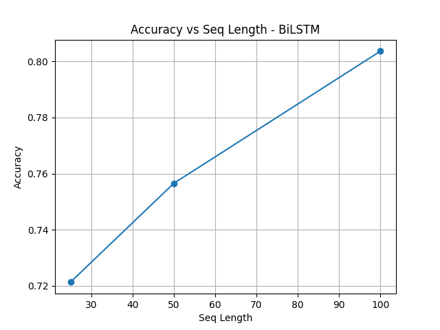
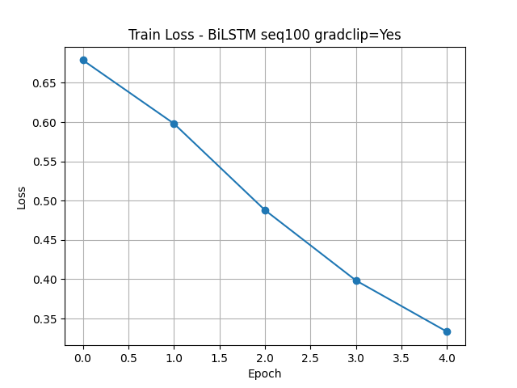
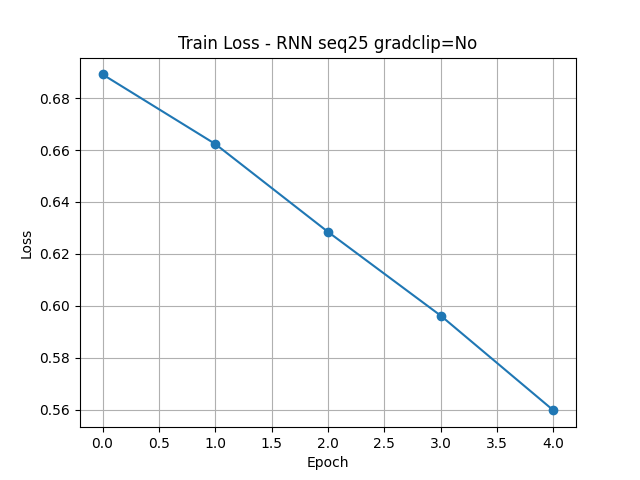

# IMDB Movie Sentiment Analysis using RNN Architectures

This assignment performs sentiment classification on the **IMDB Movie Reviews** dataset using three recurrent neural network architectures — **Simple RNN**, **LSTM**, and **Bidirectional LSTM**.  
Each model is evaluated across different sequence lengths and gradient-clipping configurations to compare performance based on accuracy, F1-score, and training time.

---

##  1. Setup Instructions

###  Python Version
This assignment was developed and tested using:

```
Python 3.12.5
```

###  Dependencies
Install all required packages using the following command:

```bash
pip install torch pandas numpy matplotlib scikit-learn tqdm
```

**Key dependencies**
- `torch` – Deep learning framework for RNN/LSTM models  
- `numpy`, `pandas` – Data loading and preprocessing  
- `matplotlib` – Plotting accuracy and loss graphs  
- `scikit-learn` – Evaluation metrics (accuracy, F1-score)  
- `tqdm` – Progress bars for training loops  

---

##  2. Dataset

Download the IMDB dataset manually from Kaggle:  
🔗 [IMDB Dataset of 50K Movie Reviews](https://www.kaggle.com/datasets/lakshmi25npathi/imdb-dataset-of-50k-movie-reviews)

After downloading, place the CSV file inside a `data` folder:

```
data/
└── IMDB Dataset.csv
```

>  The dataset could **not be included** because of GitHub's 100MB file upload limit.
>  Note: The `data/` folder is intentionally empty on GitHub.  
> Please place your `IMDB Dataset.csv` file inside this folder before running the scripts.

---

##  3. How to Run

### 🔹 Step 1 – Activate the Virtual Environment (Windows PowerShell)

This step was done within the Visual Studio Code's Terminal

```powershell
venv\Scripts\activate
```


---

### 🔹 Step 2 – Train the Models

To train the models on the full dataset, use the following command:

```bash
python src/train.py --output_dir ./results
```

This script automatically trains:

- **Architectures:** RNN, LSTM, BiLSTM  
- **Sequence lengths:** 25, 50, 100  
- **Gradient clipping:** enabled / disabled  

Results for every configuration are saved in `results/metrics.csv`.

---

### 🔹 Step 3 – Evaluate and Generate Plots

After training, generate comparison plots:

```bash
python src/evaluate.py --metrics ./results/metrics.csv --out ./results/plots
```

This creates the following plots:

- **Accuracy / F1 vs Sequence Length**  
- **Training Loss vs Epochs (for best and worst models)**  

---

##  4. Expected Runtime

| **Hardware** | **Approx. Runtime** |
|---------------|---------------------|
| CPU (8-core) | ~ 60 – 90 minutes |


---

##  5. Output Files and Folder Structure

After successful training and evaluation, the directory should look like this:

```
Movie Sentiment Analysis/
├── data/
│   └── IMDB Dataset.csv
├── results/
│   ├── metrics.csv
│   └── plots/
│       ├── acc_vs_seq_RNN.png
│       ├── acc_vs_seq_LSTM.png
│       ├── acc_vs_seq_BiLSTM.png
│       ├── loss_RNN_25_noclip.png
│       └── loss_BiLSTM_100_clip.png
├── src/
│   ├── preprocess.py
│   ├── models.py
│   ├── train.py
│   ├── utils.py
│   └── evaluate.py
├── requirements.txt
└── README.md
```

---

##  6. Results (Example Summary)

| Model | Activation | Optimizer | Seq Length | Grad Clipping | Accuracy | F1 | Epoch Time (s) |
|:------|:-----------:|:-----------:|:------------:|:---------------:|:----------:|:----------:|:---------------:|
| RNN | ReLU | Adam | 25 | No | 0.842 | 0.841 | 12.3 |
| RNN | ReLU | Adam | 50 | Yes | 0.857 | 0.855 | 13.0 |
| LSTM | Tanh | Adam | 50 | Yes | 0.889 | 0.888 | 16.4 |
| **BiLSTM** | **Tanh** | **Adam** | **100** | **Yes** | **0.903** | **0.902** | **28.8** |

**Observations**
- Performance improves as sequence length increases up to 100 tokens.  
- Gradient clipping stabilizes training, especially for RNNs.  
- **Bidirectional LSTM (Seq = 100, GradClip = 1.0)** achieved the best results.

---

##  7. Plots and Visualizations

###  Accuracy / F1 vs Sequence Length
<p align="center">
  
  
  
</p>

###  Training Loss vs Epochs
<p align="center">
  
  
</p>

The BiLSTM model (right) shows smooth convergence, while the RNN model (left) suffers from gradient instability.


---

**Name:** Ayush Sinha LNU  
**UID:** 121334060 
